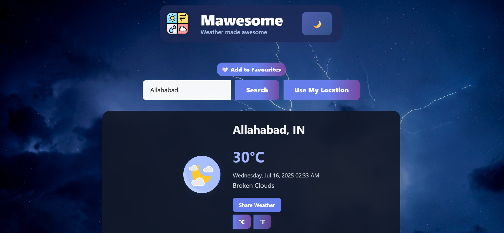
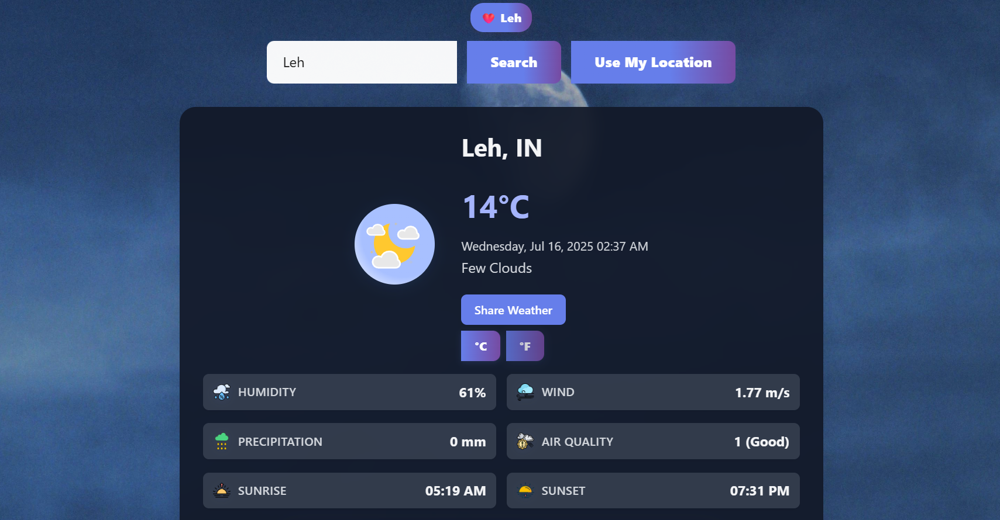
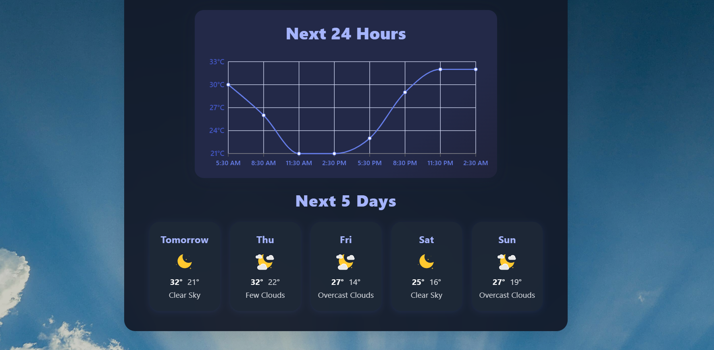
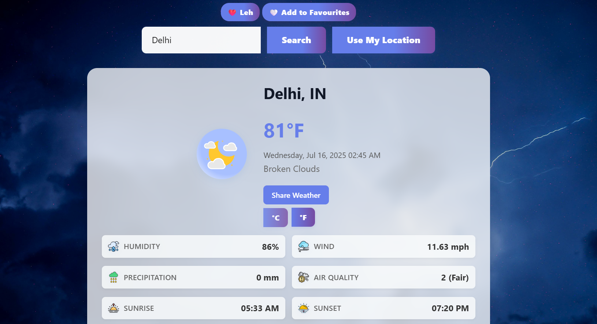
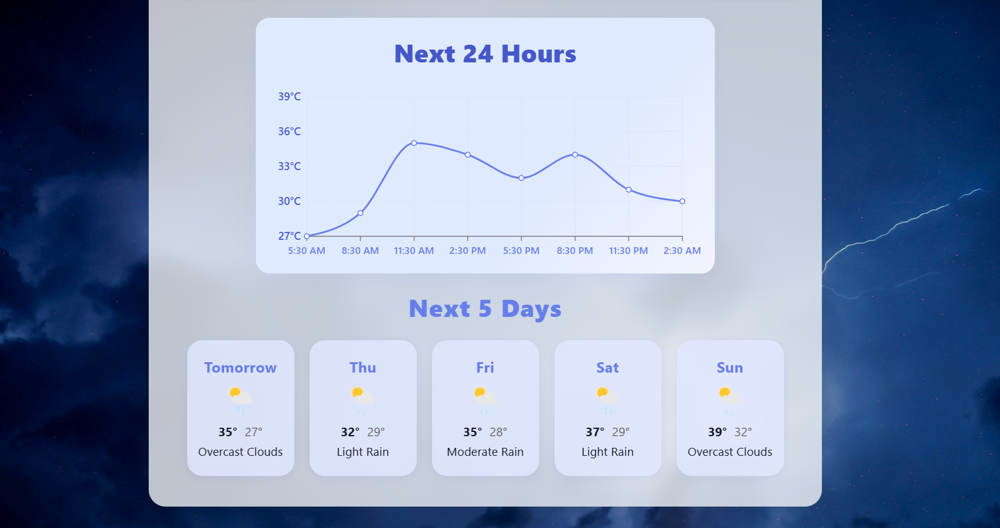
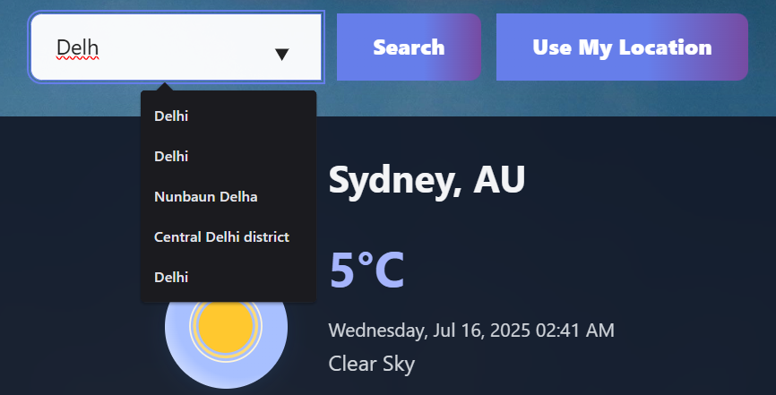
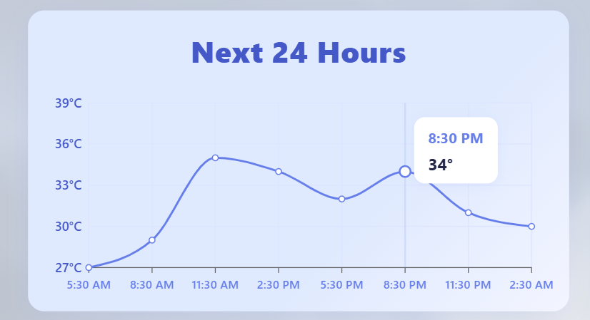
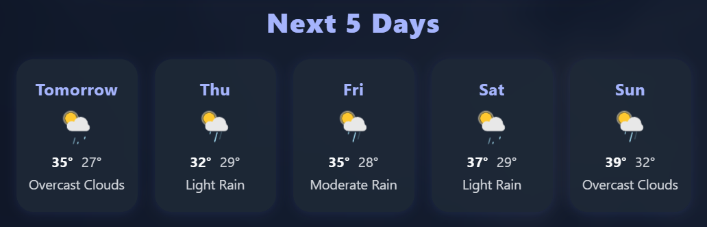
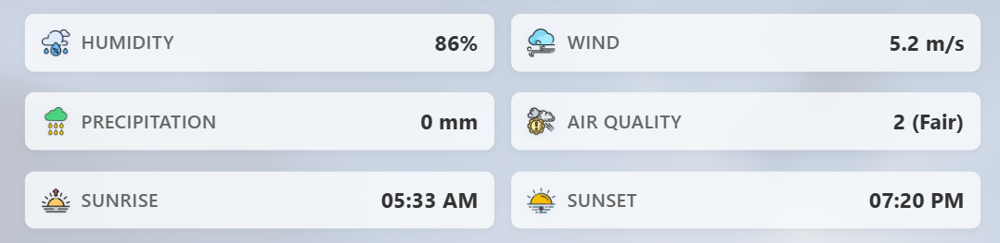
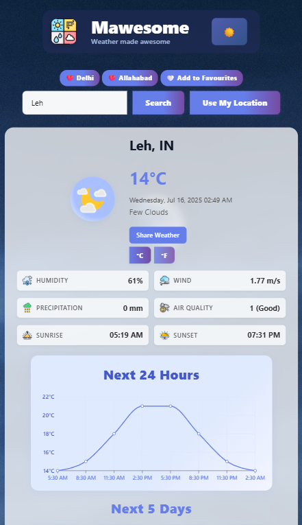

# 🌤️ Mawesome Weather App

**Mawesome** is a modern weather forecasting web app built with **React**, **Vite**, and **Tailwind CSS**, using real-time data from the **OpenWeatherMap API**.  
It features clean design, responsive layout, dynamic backgrounds, current location support, and a smooth user experience — perfect for showcasing on your portfolio or resume 🚀

👉 **Live Demo:** [https://mawesome.vercel.app](https://mawesome.vercel.app)

---

## ✨ Features

- 🌐 Search weather by city or use current geolocation
- 🌞 Shows temperature, humidity, precipitation, AQI, wind speed, sunrise/sunset
- 🎨 Dynamic background images that match weather conditions (sunny, clouds, rain, etc.)
- 📱 Mobile & desktop responsive (fully Tailwind-powered)
- ⚡ Fast setup with Vite + optimized production build
- ☁️ Deployed live on Vercel

---

## 🛠️ Tech Stack

| Tech           | Description                         |
|----------------|-------------------------------------|
| React          | UI with functional components & hooks |
| Vite           | Lightning-fast builds               |
| Tailwind CSS   | Utility-first styling               |
| OpenWeatherMap | Weather data API                   |
| Vercel         | Hosting & CI/CD                     |

---

## 🚀 Getting Started

To run the app locally:

Clone this repository
git clone https://github.com/anmol3008/weather-app.git
cd weather-app

Install dependencies
npm install

Start the development server
npm run dev

To build for production
npm run build

---

## 📦 Folder Structure

weather-app/
│
├── public/ # Static files
├── src/ # Main source code
│ ├── assets/ # Background images & icons
│ ├── components/ # React components
│ ├── App.jsx # Root app component
│ └── main.jsx # Entry point
├── index.html # HTML template
├── tailwind.config.js # Tailwind customization

---

## 🖼️ Screenshots

## 🖼️ Screenshots

### 🌑 Dark Mode Views

### 🌞 Light Mode Views

### 🔍 Features & Views

### 📱 Mobile View

---

## 📋 License

This project is licensed under the [MIT License](LICENSE).

---

## 🙋‍♂️ Author

**Anmol Kumar**  
🔗 [GitHub](https://github.com/anmol3008)  
🌐 [Live Site](https://mawesome.vercel.app)

---

> ⭐ *If you like this project, give it a star on GitHub and feel free to connect!*
