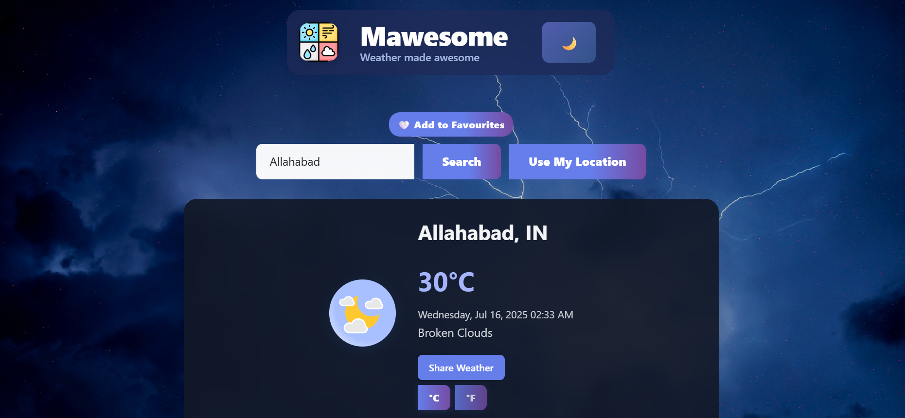
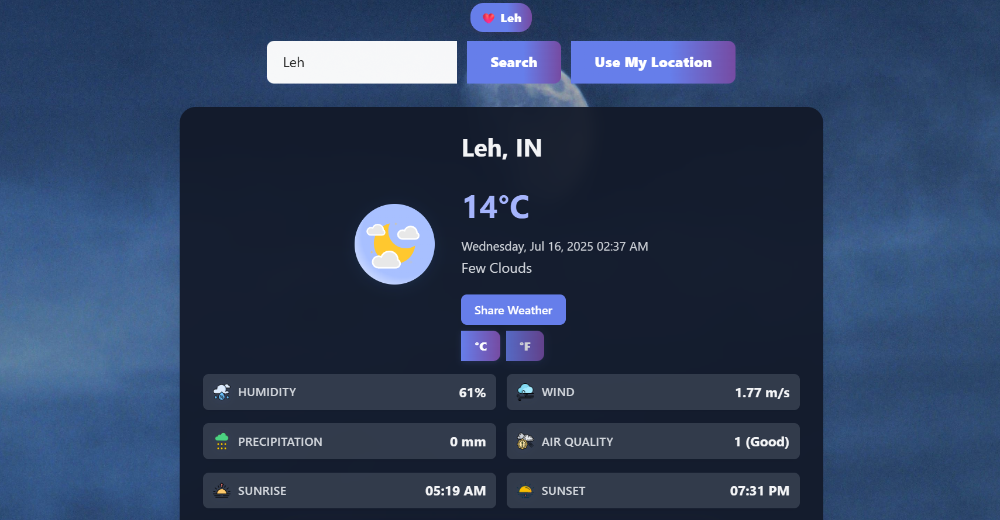
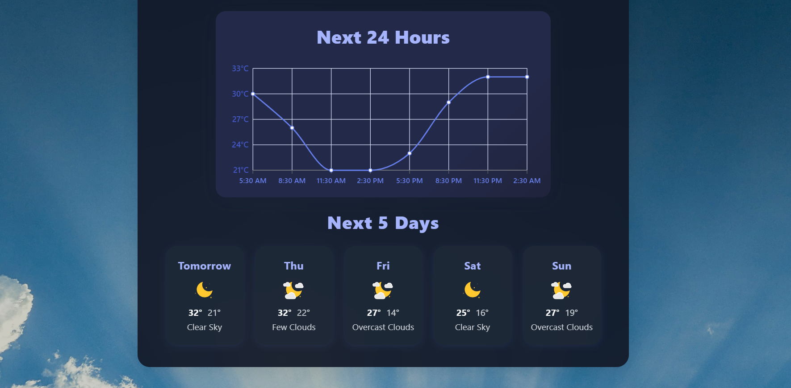
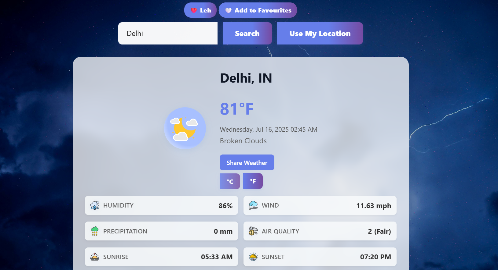
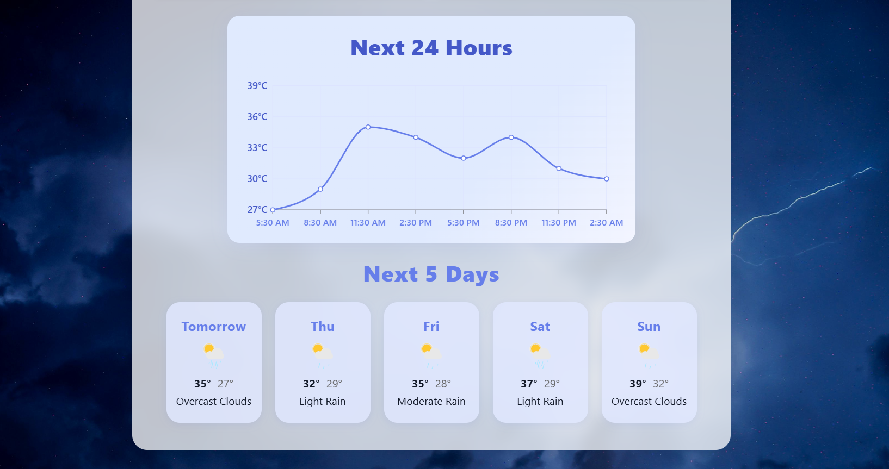
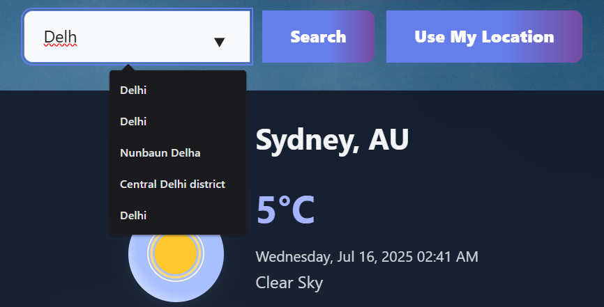
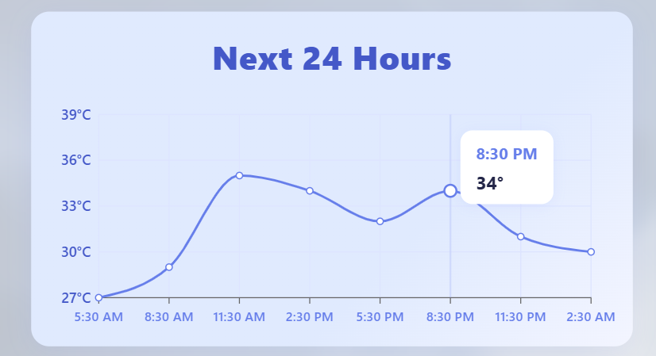
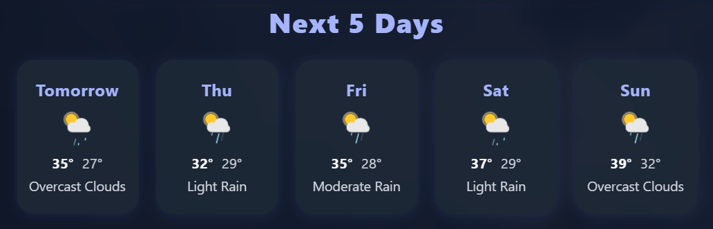
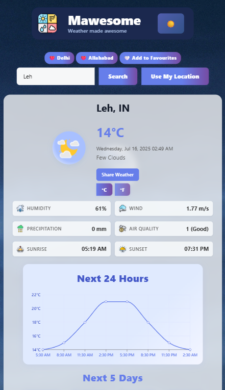
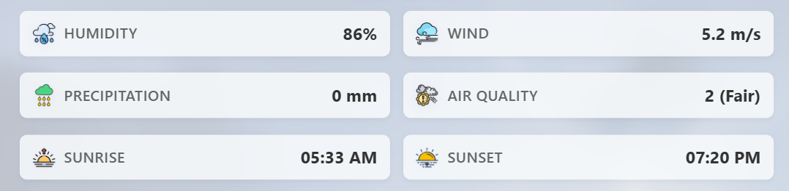

# 🌤️ Mawesome Weather App

**Mawesome** is a modern weather forecasting web app built with **React**, **Vite**, and **Tailwind CSS**, using real-time data from the **OpenWeatherMap API**.  
It features clean design, responsive layout, dynamic backgrounds, current location support, and a smooth user experience

👉 **Live Demo:** [https://mawesome-weather.vercel.app](https://mawesome-weather.vercel.app)

---

## ✨ Features

- 🌐 Search weather by city or use current geolocation
- 🌞 Shows temperature, humidity, precipitation, AQI, wind speed, sunrise/sunset
- 🎨 Dynamic background images that match weather conditions (sunny, clouds, rain, etc.)
- 📱 Mobile & desktop responsive (fully Tailwind-powered)
- ⚡ Fast setup with Vite + optimized production build
- ☁️ Deployed live on Vercel

---

## 🛠️ Tech Stack

| Tech           | Description                         |
|----------------|-------------------------------------|
| React          | UI with functional components & hooks |
| Vite           | Lightning-fast builds               |
| Tailwind CSS   | Utility-first styling               |
| OpenWeatherMap | Weather data API                   |
| Vercel         | Hosting & CI/CD                     |

---

## 🚀 Getting Started

To set up and run this project locally:

1. **Clone the repository**

git clone https://github.com/anmol3008/weather-app.git

cd weather-app

2. **Install dependencies**

npm install

3. **Start the development server**

npm run dev

4. **Create a production build**

npm run build

---

## 📦 Folder Structure

weather-app/
├── public/ # Static files
├── src/ # Application source code
│ ├── assets/ # Background images & weather icons
│ ├── components/ # Reusable React components
│ ├── App.jsx # Root component
│ └── main.jsx # Entry point
├── index.html # Base HTML template
├── tailwind.config.js # Tailwind CSS configuration
├── README.md # Project documentation
└── package.json # Project metadata and scripts

---

## 🖼️ Screenshots

### 🌑 Dark Mode  
Experience stunning weather visuals with a modern dark interface — easy on the eyes, perfect for night and low-light use.

---

### 🌞 Light Mode  
Enjoy a fresh, bright layout with crisp details and vibrant weather info, ideal for daytime and high contrast.

---

#### 🔎 Search  
Effortlessly find weather by typing any city name.  

---

#### 🕒 Hourly Forecast  
Hourly temperature and conditions at a glance.  

---

#### 📅 5-Day Forecast  
Stay ready with a five-day outlook.  

---

#### ⭐ Favourites  
Save your go-to cities for quick access.  

---

#### 📱 Mobile View  
Responsive and smooth — great on any screen.  

---

#### 📊 Weather Stats  
All stats in one view: humidity, precipitation, wind, AQI, sunrise & sunset.  

---

## 📋 License

This project is licensed under the [MIT License](LICENSE).

---

## 🙋‍♂️ Author

**Anmol Kumar**  
🔗 [GitHub](https://github.com/anmol3008)  
🌐 [Live Site](https://mawesome-weather.vercel.app)

---

> ⭐ *If you like this project, give it a star on GitHub and feel free to connect!*
